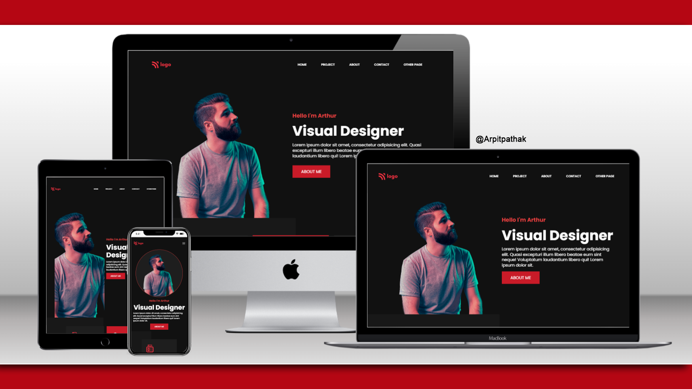

# Portfolio Website 🌐

## Project 15 🚀 Website's [Live Link](https://portfolio-15.netlify.app/)🔗

>by Arpit Pathak

### Screenshot

### website on different devices

### Mobile view

## 📌 What I learned from this Project? 📝
- I learned how to make beautiful cards.
- Learned about Flexbox and its properties `justify-content`, `align-items`, `gap` & `flex-direction`.
- Learned to change color of svg file from CSS.
- Learned to use CSS variables.
- Learned about `box-shadow`
- Learned about `transition` to change property values smoothly, over a given duration.
- Learned about media query for make website responsive to all devices.
- Added effect on hover over navbar links and buttons.

## 📌 Time taken to finish this project ⏳
- 6.5 hours + 1.5 hour for making website responsive
---

